# Repit User Manual

**Train. Track. Repeat.**

This guide covers the user-facing features in **Repit 1.1.0**. Repit helps you plan strength workouts, record sets, review your training history, and follow exercise progress.

Button and menu names appear in **bold**. Some controls display an icon instead of text; this guide identifies both where helpful.

## Contents

- [1. Get started](#1-get-started)
- [2. Manage your exercises](#2-manage-your-exercises)
- [3. Create and manage templates](#3-create-and-manage-templates)
- [4. Start and record a workout](#4-start-and-record-a-workout)
- [5. Use the rest timer](#5-use-the-rest-timer)
- [6. Complete or cancel a workout](#6-complete-or-cancel-a-workout)
- [7. Review and correct workout history](#7-review-and-correct-workout-history)
- [8. Add a workout you already completed](#8-add-a-workout-you-already-completed)
- [9. Follow records and progress](#9-follow-records-and-progress)
- [10. Adjust your preferences](#10-adjust-your-preferences)
- [11. Back up, import, and recover your data](#11-back-up-import-and-recover-your-data)
- [12. Troubleshooting and support](#12-troubleshooting-and-support)

## 1. Get started

### Find your way around

Use the five tabs at the bottom of the app:

| Tab | What you can do |
| --- | --- |
| **Today** | Start or continue a workout, record sets, use the rest timer, and review today's completed workout. |
| **Exercises** | Browse and manage exercises, record exercise notes, and see personal records and progress. |
| **Templates** | Create reusable workout plans with exercises and planned sets. |
| **History** | Browse completed workouts by month, correct recorded sets, add past workouts, and open Insights. |
| **Settings** | Choose weight units, configure the completion assessment, manage backups and recovery, and find support. |

Repit starts with an exercise library and six starter templates: **Push**, **Pull**, **Legs**, **Upper Body**, **Lower Body**, and **Full Body**. You can adapt these to your own routine.

<!-- > **Screenshot 01 — Today and navigation:** Show Today before starting a workout, with several starter template cards, their exercise/set counts, and all five bottom tabs visible. If needed, use a second image to show **Start empty workout** below the cards. -->
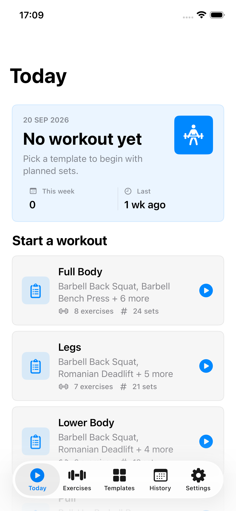

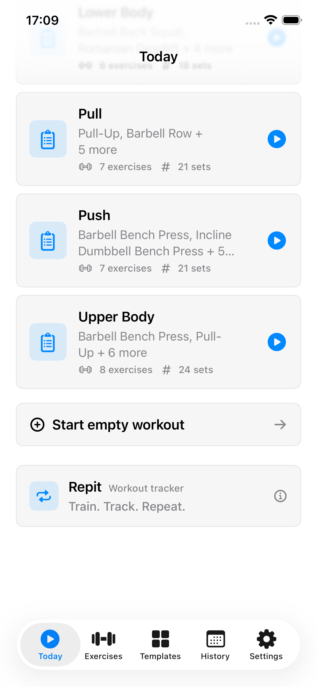

### Log your first workout

1. Open **Settings** and choose your preferred **Weight unit**.
2. Open **Today**.
3. Tap a template card, or choose **Start empty workout** and then **Add exercise**.
4. For each set, enter the reps and weight you actually use.
5. Tap the set's completion circle after performing it.
6. Use the timer icon when you want to time a rest period.
7. Tap **Complete workout** when you finish.
8. Resolve any unfinished sets and optionally save a self-assessment.
9. Find the saved workout in **History**.

### Understand the basic rules

- You can have **one active workout at a time** and **one workout per calendar day**.
- An exercise can appear only once in a workout or template. Add more sets to its existing entry when needed.
- A saved completed workout needs at least one exercise, and each retained exercise needs at least one set.
- Sets support **1–999 reps**, a weight from **0 to 1,000 kg** or its equivalent in pounds, and up to **100 sets per exercise**.
- Repit saves active-workout changes locally as you make them. Forms such as exercise and template editors have a **Save** button.
- Your active workout remains available when you return to the app. Switching tabs does not complete or cancel it.

> **Tip:** Check the prefilled weights before training. Suggested values are a starting point for your log.

## 2. Manage your exercises

### Find an exercise

1. Open **Exercises**.
2. Use the search field to search by exercise name, primary muscle group, or secondary muscle group.
3. Open **Sort** to choose **Name**, **Frequency**, or **Last performed**.
4. Tap an exercise to open its details.

Frequency and last-performed information come from completed training history. Exercise selectors used while building templates or workouts also support searching and sorting.

<!-- > **Screenshot 02 — Exercise library:** Show a search result for a muscle group, exercise names and muscle-group descriptions, the Sort control, and the plus button for a new exercise. -->

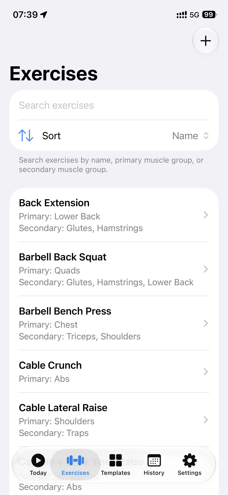

### Create an exercise

1. Tap the **plus (+)** button in **Exercises** to open **New exercise**.
2. Enter a name.
3. Choose a **Primary muscle group**.
4. Optionally select one or more **Secondary muscle groups**. The primary group cannot also be secondary.
5. Optionally enter **Notes**, such as a machine setting or a reminder you want to see during workouts.
6. Tap **Save**.

<!-- > **Screenshot 03 — New exercise:** Show a sample exercise name, the selected primary muscle group, selected secondary groups, a short equipment-setting note, and Save. -->

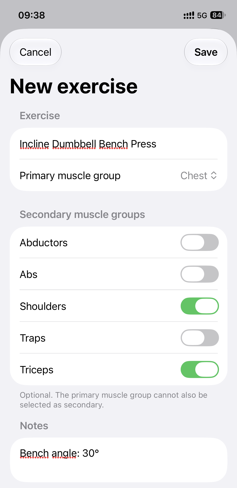

### Edit an exercise and its notes

1. Open the exercise in **Exercises**.
2. Tap **Edit exercise**.
3. Update the name, muscle groups, or notes.
4. Tap **Save**.

You can also open **Edit exercise** from an exercise's actions menu during an active workout. These changes update the exercise in your library, including where its details are displayed in templates and workouts. Exercise notes belong to the exercise; a workout self-assessment note belongs to an individual completed workout.

### Delete an exercise

Open its detail page, tap **Delete exercise**, and confirm. A delete action is also available by swiping its library row.

Repit prevents deletion when the exercise is used in a template, an active workout, or completed history. This keeps existing plans and training records usable. Remove an unused exercise from relevant templates or an active workout first, if appropriate; exercises needed by completed history remain protected.

## 3. Create and manage templates

A template is a reusable plan containing an ordered list of exercises and their planned sets.

### Create a template

1. Open **Templates** and tap **plus (+)** for **New template**.
2. Enter a template name.
3. Tap **Add exercise** and choose an exercise.
4. Repeat for the other exercises in your plan.
5. Set the reps and weight for each planned set by tapping the corresponding value and confirming the adjustment with **Done**.
6. Use **Add set** for extra sets. A new set copies the preceding set's values.
7. Swipe a set row to reveal its delete control if you want fewer sets. At least one set must remain for each exercise.
8. Use **Reorder exercises** and drag the rows into your preferred order, then return to the editor.
9. Tap **Save**.

New exercises added to a template start with three sets of 12 reps at zero weight. Update them to match your plan. A template requires a name and at least one exercise.

<!-- > **Screenshot 04 — Template editor:** Show a named template with two exercises, numbered set rows, reps and weight values, Add set, Add exercise, Reorder exercises, and Save. Two images may be used if these controls do not fit together. -->
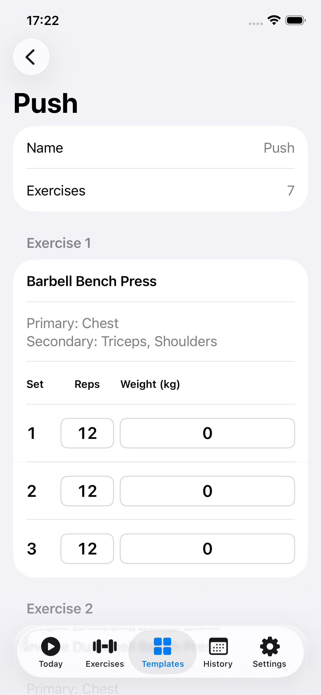

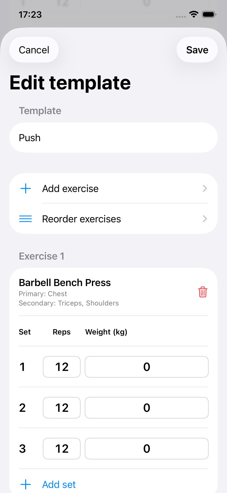

### Edit or delete a template

- To edit, open a template, choose **Edit template**, make changes, and tap **Save**. Use the exercise's trash button to remove it from the plan.
- To delete, open the template, choose **Delete template**, and confirm. A delete action is also available in the template list.

Deleting a template does not delete completed workouts. Those workouts remain available with the last known template name. Changes you make to the exercises or sets of an active workout do not rewrite its template.

### How planned sets become workout suggestions

When Repit loads an exercise into a workout, it chooses suggested sets in this order:

1. The exercise's sets from its **most recent completed workout**, if available.
2. Its planned sets in the selected template, if there is no previous performance.
3. Three sets of 12 reps at zero weight when neither is available.

This means a workout can start with different set counts, reps, or weights from those displayed in its template. The same suggestion order is used when preparing a manually entered completed workout.

## 4. Start and record a workout

### Start from a template or start empty

1. Open **Today**.
2. Tap the template you want to use. Its card shows the planned exercise and set counts.
3. Alternatively, tap **Start empty workout**, then **Add exercise** to build the workout as you go.

If a workout is already active, Today shows it. If you have already completed today's workout, Today offers its details and explains that no more workouts can be started that day.

An active workout from an earlier date remains active. Finish or cancel it before starting another workout. It keeps its original workout date even if you finish after midnight.

### Enter reps and weight

Each exercise contains numbered set rows with **Reps**, **Weight**, and a completion control. A **Previous** column appears when earlier completed sets are available. It shows the corresponding set from the exercise's most recent completed workout; extra rows without a matching earlier set have no previous value.

1. Tap a set's reps value to open **Adjust reps**.
2. Use the adjustment buttons or enter **Exact reps**.
3. Tap **Done** to apply the value, or **Cancel** to leave it unchanged.
4. Tap the weight value to open **Adjust weight**.
5. Use the plus/minus buttons or enter **Exact weight** in the unit shown.
6. Tap **Done**.

Weight adjustments offer steps of **1**, **1.25**, **2.5**, and **5** in your selected unit. Exact weight input accepts a decimal point or comma and up to two decimal places, such as `12.5` or `12,50`. Enter numbers without a unit suffix or thousands separator. Zero weight is allowed; negative weights are not.

<!-- > **Screenshot 05 — Active workout:** Show an exercise with the Previous, Reps, and Weight columns, one completed set and one unfinished set, Add set, the exercise actions menu icon, and the timer control. -->
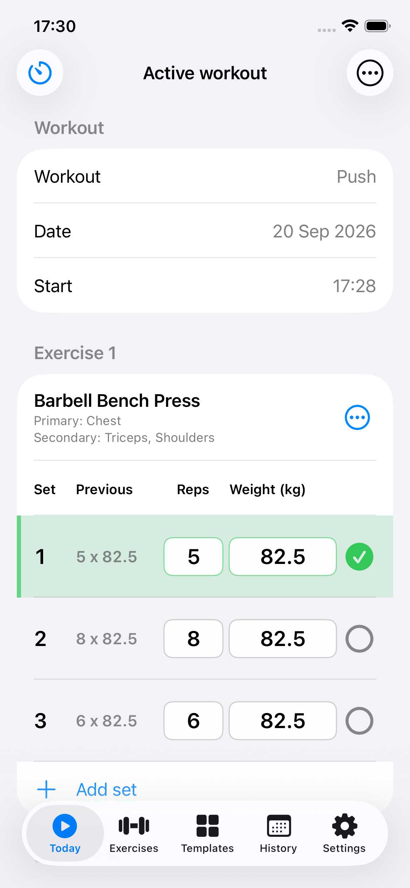

<!-- > **Screenshot 06 — Adjust weight:** Show the current weight, the four adjustment step controls, an example in Exact weight, and the Done and Cancel controls. -->
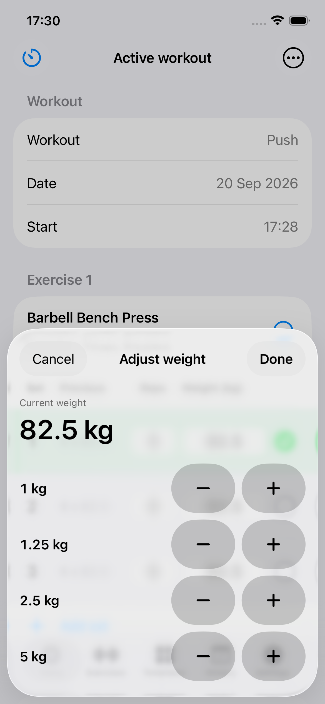

### Mark sets completed or reopen them

Tap the completion circle on a set after you perform it. Tap it again to reopen the set if it was marked by mistake.

The exercise's estimated 1RM updates from its completed sets. Marking every set in an exercise completed also marks that exercise completed, but you must still choose **Complete workout** to finish the whole session.

### Add and remove sets

- Tap **Add set** beneath an exercise. The new unfinished set copies the last set's reps and weight.
- Swipe a set row to reveal the trash control and remove it.
- You cannot remove the last remaining set with the row's delete control.

### Add, reorder, replace, or remove exercises

Use **Add exercise** to choose another library exercise. Exercises already in the workout are excluded from the choices.

Open an exercise's **Exercise actions** menu to:

| Action | Result |
| --- | --- |
| **Exercise history** | View earlier performances for this exercise. |
| **Exercise progress** | Open its estimated 1RM chart. |
| **Edit exercise** | Update its library details and notes. |
| **Move up / Move down** | Change its position in the current workout. |
| **Replace exercise** | Choose an alternative and load that alternative's suggested sets. |
| **Remove from workout** | Remove the exercise and its sets after confirmation. |

Replacement and removal are available only when the exercise has no completed sets. If a set was completed accidentally, reopen it first. The replacement picker groups exercises with the same primary muscle group above other options. Replacing an exercise replaces its set values too.

<!-- > **Screenshot 07 — Exercise actions and replacement:** Show the actions menu for an exercise with no completed sets, including Replace exercise and Remove from workout. Add a second image of the replacement picker showing Same primary muscle group and Other exercises. -->
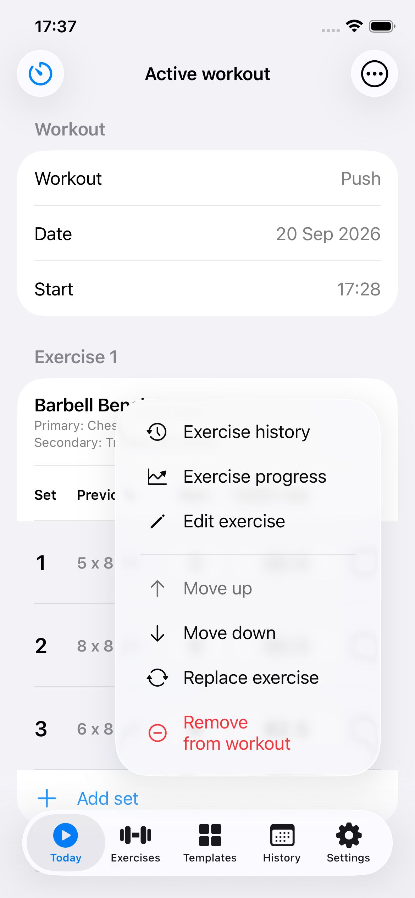

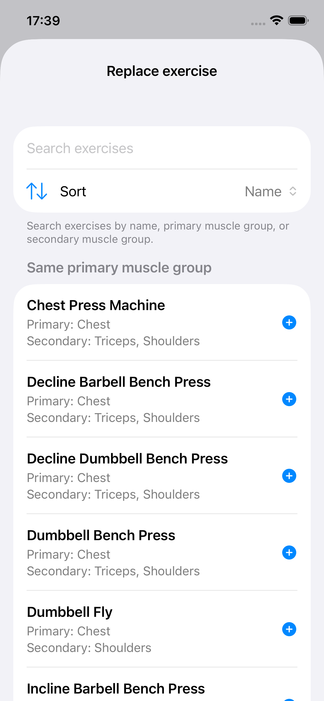

### Show notes and hide completed exercises

- Tap an exercise's note icon to show or hide its notes when notes exist.
- Open **Workout actions** in the toolbar for **Show all notes** or **Hide all notes**.
- In the same menu, turn on **Hide completed exercises** to keep the remaining work visible.
- Turn it off in **Workout actions** to reveal completed exercises again, for example to correct or reopen a set.

The hide-completed preference is remembered. Hiding an exercise does not delete it or finish the workout.

## 5. Use the rest timer

The rest timer is available while a workout is active. Start it yourself when you want a timed rest.

1. Tap the **timer icon** in the active workout's toolbar.
2. Tap **0:30**, **1:00**, **1:30**, **2:00**, or **3:00** to start that duration immediately.
3. For another duration, tap **Custom**, select a time, and tap **Start**. Custom durations range from **5 seconds to 10 minutes**, in five-second steps.
4. While it runs, use **−10 sec** or **+10 sec** to adjust the remaining time.
5. Tap **Close** to return to the workout while the timer continues. The toolbar displays the remaining time.
6. Tap **Skip** to end the rest early.

Only one rest timer runs at a time. Completing or canceling its workout stops it. Closing the timer panel or leaving the app does not pause its countdown.

When prompted, allow notifications if you want a **Rest finished** alert while the app is in the background. In the foreground, the timer provides sound and haptic feedback where supported. Notification delivery and sound depend on your device settings.

<!-- > **Screenshot 08 — Rest timer:** Use two images: the duration-selection panel with Custom, and a running countdown showing the −10 sec, Skip, and +10 sec controls. -->
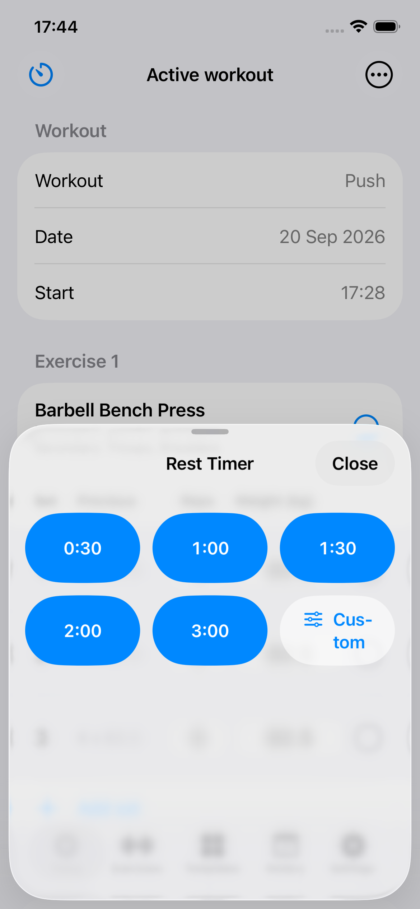

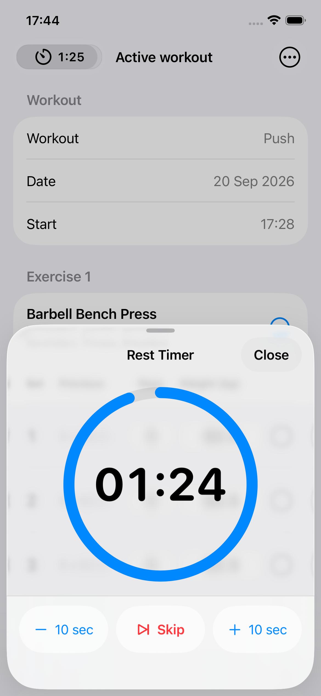

## 6. Complete or cancel a workout

### Complete the workout

1. Review your reps, weights, and completion marks.
2. Tap **Complete workout**.
3. If any sets are unfinished, choose how to handle them:

| Choice | What happens |
| --- | --- |
| **Mark unfinished sets as completed** | Keeps all sets and marks them completed using their current reps and weights. |
| **Remove unfinished sets before saving** | Keeps only completed sets and removes exercises that have no completed sets. This option requires at least one completed set. |
| **Continue workout** | Returns to the active workout without finishing. |

4. Complete or skip the optional self-assessment if it appears.
5. Review the saved workout. It is now available in **History** and from **Today** when it is today's workout.

> **Note:** Choose “Mark unfinished sets as completed” only when the listed sets reflect what you performed. Keeping unused suggested sets would affect your training statistics.

<!-- > **Screenshot 09 — Unfinished sets:** Show the completion prompt with both save choices and Continue workout. Use a sample workout with at least one completed and one unfinished set so all choices are visible. -->
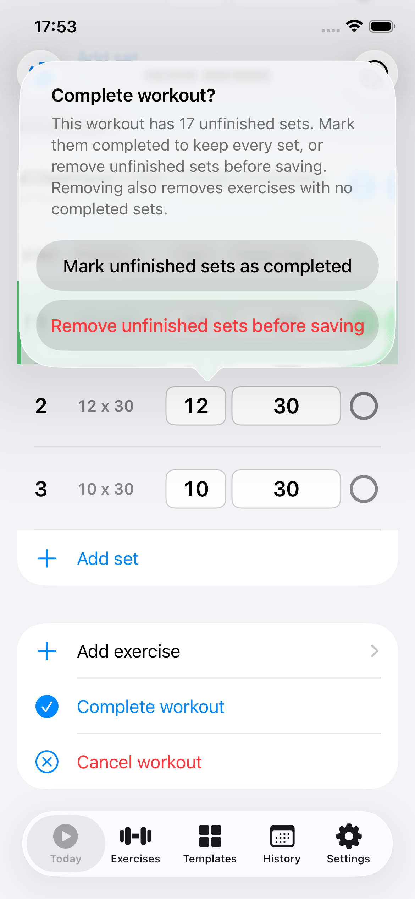

### Save a self-assessment

If **Show self-assessment when completing a workout** is enabled in Settings, you can record:

- **How did you feel?** Choose Very weak, Weak, Normal, Strong, or Very strong.
- **Perceived exertion:** Select a value from **0 — None** to **10 — Maximum**.
- **Note:** Optionally describe the workout in your own words.

Tap **Save assessment and complete**, or choose **Complete without assessment**. **Back** returns without completing the workout. Saved condition ratings contribute to the Condition history chart in Insights.

<!-- > **Screenshot 10 — Self-assessment:** Show the five condition faces, exertion slider, a short sample note, and both completion choices. -->
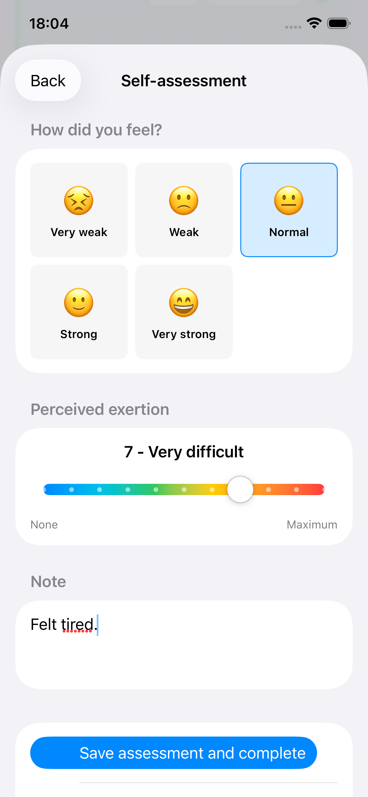

### Cancel the workout

1. Tap **Cancel workout** in the active workout.
2. Read the confirmation.
3. Choose **Permanently cancel workout** to discard it, or **Back** to continue.

Canceling removes all data for that active workout, including completed sets, and stops its rest timer. It does not create a History entry.

## 7. Review and correct workout history

### Browse completed workouts

1. Open **History**.
2. Use the month arrows to browse or tap **This month** to return to the current month.
3. Tap a marked workout date on the calendar, or a workout in the list beneath it.
4. Review the workout date, start and completion times, saved assessment if present, exercises, estimated 1RM values, and recorded sets.

The list shows workouts for the displayed month. Calendar weeks follow your device's calendar and locale.

<!-- > **Screenshot 11 — History:** Show a month with several marked workout dates, the month-navigation controls, workout rows with duration information, and the Insights and plus icons. -->
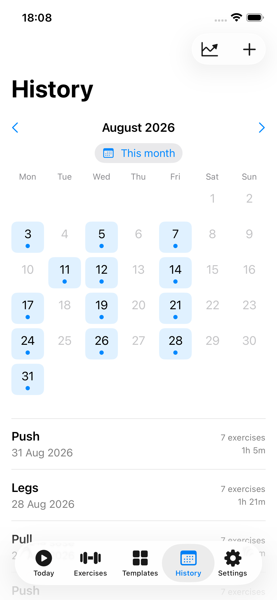

### Correct reps or weight in a saved workout

1. Open the completed workout.
2. Tap the reps or weight value in the set you want to correct.
3. Enter the corrected value in **Adjust reps** or **Adjust weight**.
4. Tap **Done**.

Repit saves the correction and recalculates affected estimated 1RM values, personal records, and progress data. There is no separate Save button for the whole completed workout.

The completed-workout screen supports corrections to existing set reps and weights. It does not provide a general editor for the workout's date, exercise list, number of sets, or saved self-assessment.

<!-- > **Screenshot 12 — Completed workout:** Show the workout's date and times, a saved assessment, and an exercise with its estimated 1RM and tappable reps/weight values. Include the delete control if visible. -->
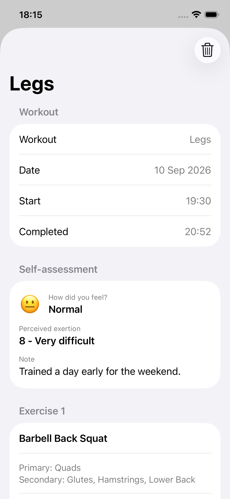

### Delete a completed workout

1. Swipe its row in **History** and tap the trash control, or open it from History and tap **Delete workout**.
2. Confirm **Delete workout**.

Deletion permanently removes that workout from history and from the statistics based on it. Its date becomes available for another workout. Export a backup first if you may want to preserve the record.

## 8. Add a workout you already completed

Use this when you trained without recording a live workout.

1. Open **History** and tap **plus (+)** for **Add completed workout**.
2. Choose the **Date**, **Start time**, and **End time**.
3. Choose a **Template** to load the initial exercise and set list. A template is required for this workflow; create one first if none is available.
4. Check every suggested set against what you actually performed. All sets in this draft start as completed.
5. Tap reps and weights to adjust them. Add or delete sets as needed.
6. Use **Add exercise**, **Reorder exercises**, or each exercise's actions menu to move, replace, or delete exercises.
7. Optionally choose **Add self-assessment**, enter your condition, exertion, and note, then tap **Save assessment**. Before saving the workout, you can edit or remove that assessment.
8. Tap **Save** in the completed-workout form.

> **Note:** Select the template before customizing the draft. Choosing another template reloads the exercise and set list.

The date cannot be in the future or already contain another workout, including an active one. The completion time must be after the start and cannot be in the future. If you enter an end time earlier than or equal to the start time, Repit treats it as the next day. Check these times carefully so that you do not accidentally record an overnight workout.

Tap **Cancel** to leave without saving the draft.

<!-- > **Screenshot 13 — Manual workout entry:** Show Date, Start time, End time, the selected Template, an optional assessment, and the beginning of the loaded exercise list with Save visible. -->
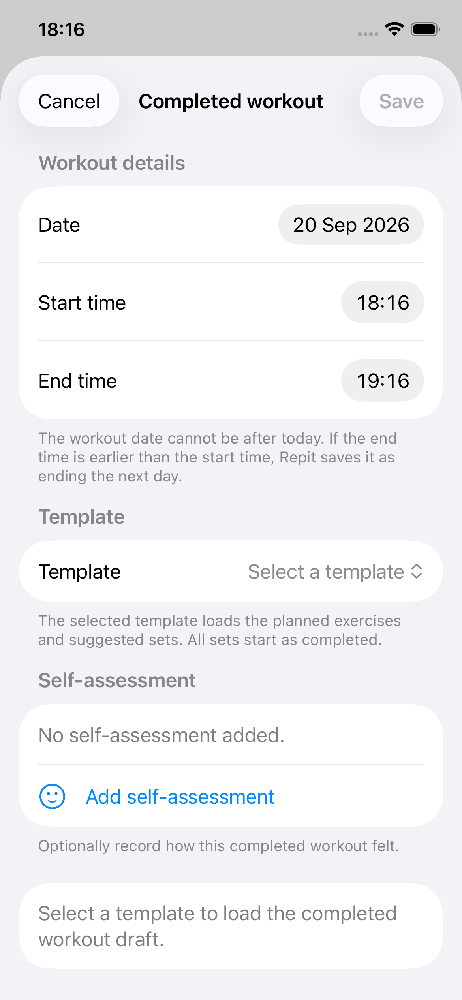

## 9. Follow records and progress

### Personal records

Open an exercise in **Exercises** to see its **Personal records**, once completed performances are available. Tap the information icon for explanations.

| Record | Meaning |
| --- | --- |
| **Estimated 1RM** | The highest estimated weight for one repetition, calculated from recorded reps and weight. |
| **Best set** | The heaviest completed set. When weights match, the set with more reps ranks higher. |
| **Best volume** | The highest total for this exercise in one workout, adding reps × weight across its completed sets. |

Personal records use completed workouts. Sets in an ongoing workout do not become historical personal records until that workout is completed.

### Exercise history

Open an exercise and choose **Exercise history** to review its previous completed performances and sets. You can also open this page from **Exercise actions** during a workout.

### Exercise progress

1. Open an exercise and choose **Exercise progress**, or use that action during a workout.
2. Use the **Exercise** selector to switch exercises if desired.
3. Choose a **Date range**: **1 Month**, **3 Months**, **6 Months**, **12 Months**, **All**, or **Custom**.
4. For **Custom**, select the start and end dates and tap **Apply**.
5. Inspect the estimated 1RM chart. Tap or drag across the chart to inspect a point's date and value.

The summary metrics refer to the selected range:

- **Current:** The most recent estimated 1RM in that range.
- **Best:** The highest estimated 1RM in that range.
- **Trend:** The difference between the first and most recent estimated 1RM in that range.

One performance can show a value, but more completed workouts are needed to show a trend. Changing the date range changes the summary metrics.

<!-- > **Screenshot 14 — Exercise progress:** Show a named exercise, the date-range control, Current/Best/Trend values, and a chart with several performances and one selected point's date/value visible. -->
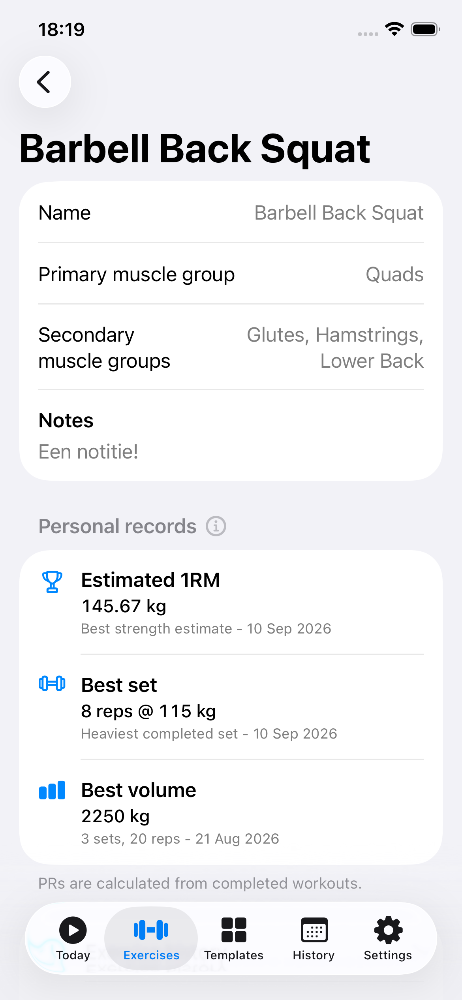

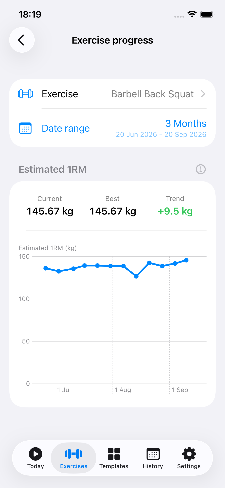

### Understand estimated 1RM and comparison badges

Estimated 1RM is an estimate derived from a set, rather than a separately recorded maximum lift. For more than one rep, Repit uses **weight × (1 + reps ÷ 30)**; for a single rep, it uses the recorded weight. The best eligible completed set supplies the exercise's estimate for a workout.

Where a comparison badge is shown, it compares the exercise's estimate with its earlier completed performance. It can indicate improvement, decline, no change, or a new result without a previous comparison. Tap the badge for its explanation. A comparison with the previous performance is different from an all-time personal record.

### Training Insights

1. Open **History**.
2. Tap **Insights**, the chart icon in the toolbar.
3. Select a date range, or choose **Custom**, set dates, and tap **Apply**.
4. Review **Training consistency** and **Condition history**.

Training consistency includes a chart of completed workouts and these metrics:

| Metric | Meaning |
| --- | --- |
| **Avg/week** | Average completed workouts per calendar week in the range, including weeks with no workouts. |
| **Active weeks** | Weeks in the range with at least one completed workout. |
| **Longest gap** | The longest stretch of calendar days without a completed workout within the range. |

Tap the information icon to read the metric definitions. Weeks follow the device calendar and locale.

**Condition history** uses only workouts with a saved self-assessment. Workouts without an assessment still count toward training consistency. Tap or drag on the charts to inspect their values. Add further rated workouts to build a condition trend.

> **Screenshot 15 — Insights:** Show the selected date range, the training-consistency metrics and chart, and the condition-history chart with sample ratings. Use two images if needed for readable labels.

## 10. Adjust your preferences

### Weight units

Open **Settings → Weight unit** and choose **Metric (kg)** or **Imperial (lbs)**. The selection controls weight entry and display throughout the app. Switching units converts how your weights appear without changing the underlying recorded amount.

### Completion assessment

In **Settings**, enable or disable **Show self-assessment when completing a workout**. Turning it off skips the assessment prompt when finishing a live workout. Previously saved assessments remain part of their workouts. The manual completed-workout form also offers an optional assessment.

### Hide completed exercises

During an active workout, open **Workout actions → Hide completed exercises**. This remembered preference hides exercises once all their sets are completed. Use the same menu to turn it off again.

> **Screenshot 16 — Settings:** Show Weight unit, the self-assessment toggle, all three Backup actions, and About Repit.

## 11. Back up, import, and recover your data

Repit stores your training data locally. Use exported backups to keep a separate copy or transfer your recorded data. This version provides file-based export and import; it has no account sign-in or automatic in-app cloud-sync workflow.

### Export a backup

1. Open **Settings**.
2. Tap **Export data**.
3. In the file-saving panel, choose a location and save the JSON backup file.
4. Wait for **Export complete**.

Backups contain your exercise library, templates, completed workouts (including their assessments), preferences, and app-version information.

**Active workouts and rest timers are not included in exported backups.** Finish a workout before exporting if you want that session included. Keep an exported copy somewhere you can access independently of Repit.

### Import a backup

1. Consider exporting your current data first.
2. Open **Settings → Import data**.
3. Select a Repit JSON backup file.
4. Read **Import preview**. It shows the source file's version and export details, plus the numbers of exercises, templates, and completed workouts that will be added or replaced.
5. Review **Import settings**, which is initially on. Turn it off to keep your current preferences.
6. Tap **Import backup**, or **Cancel** to leave your data unchanged.
7. Review the completion message.

When importing settings, the backup's weight unit, self-assessment preference, and hide-completed preference are applied.

> **Screenshot 17 — Import preview:** Show source version/export information, addition and replacement counts, Import settings with its listed preferences, and Import backup and Cancel.

### Understand what an import replaces

Repit recognizes each item by its unique identifier, called a **UUID** in the preview, rather than by its name.

- An item with a new identifier is added.
- An item with the same identifier replaces the entire existing item, even if the backup is older.
- Local items absent from the backup remain in Repit.
- Replacing a template or completed workout also replaces its exercise entries and sets. Sets are not combined individually.
- Two separately created items with the same name are not automatically merged.
- Active workouts are not imported. A conflict with an existing active workout or another workout on the same date can prevent an import.

For example, importing an older backup of a workout you recently corrected replaces that workout with its older sets. Read the replacement counts before proceeding.

Repit validates the combined data and creates an internal recovery copy before applying a valid import. A failed import does not intentionally apply only part of the file; read the error before trying again.

### Restore an internal recovery copy

A recovery copy is an internal snapshot made before importing or restoring data. It is different from an exported JSON backup.

1. Open **Settings → Restore recovery copy**.
2. Select the recovery copy you want to inspect.
3. Review its details.
4. Tap **Restore recovery copy**.
5. Confirm **Replace current data**, or choose **Cancel**.

**Restoring replaces all current Repit data with the selected snapshot. It does not merge records.** This can also change the active-workout state to the state in the snapshot. Repit saves the current data as a new recovery copy before restoring.

If you see **No recovery copies**, no copies are available yet. Use **Import data** if you have an exported backup file instead. Internal recovery copies should not be your only backup, because they are stored with the app's local files.

> **Screenshot 18 — Recovery workflow:** Show the recovery-copy list and the selected copy's Restore copy screen. Include the warning that restoration replaces current data and the final Replace current data confirmation.

## 12. Troubleshooting and support

| Issue | What to check or do |
| --- | --- |
| I cannot start another workout. | Finish or cancel the current active workout. If today's workout is already completed, Repit's one-workout-per-day limit applies. |
| Yesterday's workout is still on Today. | It remains active until you finish or cancel it. Read the date notice before continuing. |
| My suggested sets differ from the template. | Repit uses the exercise's latest completed sets first. Adjust the suggestions for the current session. |
| A completed exercise disappeared. | Turn off **Hide completed exercises** in the active workout's **Workout actions** menu. |
| I cannot add the same exercise again. | Each exercise can appear only once. Add sets to the existing entry. |
| Replace or remove is unavailable for an exercise. | The exercise has completed sets. Reopen sets marked by mistake before using these actions. |
| I cannot delete an exercise from the library. | It is referenced by a template, active workout, or completed history. Repit protects those references. |
| An exact weight is rejected. | Use a nonnegative number with at most two decimals, no unit suffix, and no thousands separator. Stay within the displayed limit. |
| I cannot delete the final set or add another set. | Each retained exercise needs at least one set; the maximum is 100 sets per exercise. |
| I cannot remove unfinished sets when completing. | At least one set must already be completed. Mark the sets you actually performed, or continue the workout. |
| A manually entered workout will not save. | Check that a template is selected, the date is available, times are valid and not in the future, and the draft has at least one exercise with valid sets. |
| Progress or personal records are empty. | Complete a workout containing that exercise. Check the chart date range. More than one performance is needed for a trend. |
| Condition history is empty. | Save a self-assessment with a completed workout and select a date range that includes it. |
| The rest timer did not notify me. | Check Repit's notification permission and your device's sound/notification settings. The countdown can still run without notification permission. |
| Import fails. | Read the error. Check that the file is a supported Repit backup and that it does not create conflicting workouts on the same day. Keep the original file intact. |
| Export fails. | Check the selected destination, available storage, and file access, then try again. Confirm that you receive **Export complete**. |

### Storage errors

If Repit displays **Storage error**, do not assume the attempted change was saved. Dismiss the message, check available storage and file access, and retry as appropriate.

If the saved data cannot be read, Repit may offer **Archive and Start Fresh**. You can dismiss that alert and try **Settings → Restore recovery copy** first. **Archive and Start Fresh** preserves the current data file in an archive and initializes fresh app data; it does not repair or restore the unreadable records. Use it only when you intend to start fresh. Keep any exported backups available for recovery.

### Contact support

Open **Settings → About Repit**, or tap the Repit branding at the bottom of the Today start screen. The About panel shows the app version and **Email Support**.

Support email: **madebymarthijn@icloud.com**.

When reporting an issue, include the app version, the action you were taking, the exact error message, and whether it concerns a live workout, completed history, or a backup. Share a screenshot if it helps explain the issue, with personal information removed.

> **Screenshot 19 — About and support:** Show the About panel with the Repit name, version/build details, and Email Support button.
